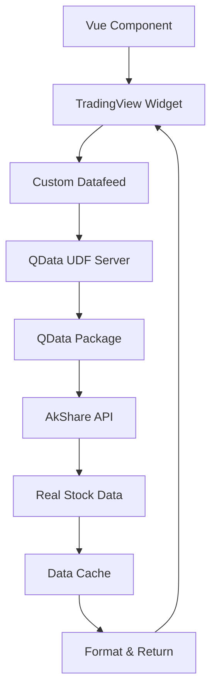

# TradingView Chart with Real Stock Data (QData Integration)

This implementation integrates TradingView charts with real Chinese stock market data using the `qdata` package, which provides access to A-share stocks and ETFs through AkShare.

## 🚀 Features

### Real Data Integration
- ✅ **真实A股数据** - 使用 qdata 包获取真实的中国股市数据
- ✅ **多种证券类型** - 支持股票和ETF数据
- ✅ **自动数据映射** - TradingView符号到A股代码的智能映射
- ✅ **数据缓存机制** - 5分钟缓存提高性能
- ✅ **错误处理** - 完善的错误处理和重试机制

### TradingView Integration
- 📈 **UDF协议兼容** - 完全兼容TradingView的Universal Data Feed协议
- 🔍 **符号搜索** - 支持股票名称和代码搜索
- ⏰ **实时状态** - 服务器连接状态实时监控
- 🎨 **中文界面** - 支持中文股票名称和界面

## 📁 文件结构

```
qtradingview/
├── src/components/
│   └── TradingViewChartQData.vue        # 真实数据图表组件
├── tests/
│   ├── qdata_udf_server.py              # QData UDF服务器
│   ├── test_qdata_integration.py        # 集成测试脚本
│   └── enhanced_udf_server.py           # 模拟数据服务器(对比用)
└── README_QDATA.md                      # 本文档
```

## 🔧 Setup Instructions

### 1. 安装依赖

确保已安装必要的Python包：

```bash
# 安装qdata包及其依赖
cd qdata
pip install -e .

# 或者手动安装依赖
pip install pandas numpy akshare requests
```

### 2. 测试QData集成

运行集成测试确保一切正常：

```bash
cd qtradingview
python tests/test_qdata_integration.py
```

测试应该显示类似以下输出：
```
🚀 QData Integration Test Suite
✅ qdata 模块导入成功
✅ qdata 初始化成功
✅ 数据提供者: AkShareProvider
📊 成功获取股票数据
📋 成功获取股票列表
```

### 3. 启动数据服务器

```bash
cd qtradingview
python tests/qdata_udf_server.py
```

服务器启动后会显示：
```
🚀 QData UDF Server for TradingView
📡 Server starting on port 8080...
🌐 TradingView datafeed URL: http://localhost:8080
✅ 使用 qdata 获取真实A股数据
```

### 4. 在Vue应用中使用

在你的Vue组件中导入并使用：

```vue
<template>
  <div class="app">
    <TradingViewChartQData />
  </div>
</template>

<script setup>
import TradingViewChartQData from './components/TradingViewChartQData.vue'
</script>
```

## 📊 Available Stock Symbols

### A股主要股票
| TradingView Symbol | A股代码 | 股票名称 |
|-------------------|---------|----------|
| MSFT | 600000 | 浦发银行 |
| GOOG | 600036 | 招商银行 |
| AMZN | 600519 | 贵州茅台 |
| META | 000858 | 五粮液 |
| NVDA | 002415 | 海康威视 |
| DIS | 600276 | 恒瑞医药 |
| BABA | 600009 | 上海机场 |

### ETF基金
| TradingView Symbol | ETF代码 | 基金名称 |
|-------------------|---------|----------|
| SPY | 512200 | 房地产ETF |
| QQQ | 159915 | 创业板ETF |
| IWM | 510300 | 沪深300ETF |
| EEM | 512880 | 证券ETF |
| VTI | 159928 | 消费ETF |

## 🔄 Data Flow



## 🛠️ Technical Details

### QData UDF Server

**核心功能:**
- **数据获取**: 使用qdata包从AkShare获取真实股票数据
- **符号映射**: 将TradingView符号映射到A股代码
- **数据缓存**: 5分钟缓存减少API调用
- **错误处理**: 完善的重试和错误恢复机制

**API端点:**
- `/config` - TradingView配置信息
- `/search` - 股票符号搜索
- `/symbols` - 股票详细信息
- `/history` - 历史价格数据
- `/time` - 服务器时间
- `/status` - 服务器状态

### Vue Component Features

**实时状态监控:**
- 服务器连接状态显示
- 数据更新时间跟踪
- 错误信息提示

**用户交互:**
- 股票符号选择器
- 时间周期切换
- 数据刷新按钮
- 服务器状态检查

## 📈 Data Format

从qdata获取的数据自动转换为TradingView格式：

```json
{
  "s": "ok",
  "t": [1640995200, 1641081600, ...],  // 时间戳数组
  "o": [14.50, 14.65, ...],            // 开盘价数组
  "h": [14.80, 14.90, ...],            // 最高价数组  
  "l": [14.30, 14.40, ...],            // 最低价数组
  "c": [14.70, 14.75, ...],            // 收盘价数组
  "v": [1000000, 1200000, ...]         // 成交量数组
}
```

## 🚨 Troubleshooting

### 常见问题

**1. 服务器连接失败**
```
❌ 服务器离线
```
- 确保数据服务器正在运行
- 检查端口8080是否被占用
- 验证防火墙设置

**2. 数据获取失败**
```
❌ 获取数据失败: Network error
```
- 检查网络连接
- 验证AkShare API可用性
- 查看服务器日志了解详细错误

**3. QData导入失败**
```
❌ Failed to import qdata
```
- 确保qdata包已正确安装
- 检查Python路径设置
- 验证依赖包版本

### 调试模式

启用图表调试模式：

```javascript
widget = new TradingView.widget({
  // ... 其他配置
  debug: true  // 启用调试日志
});
```

查看服务器日志：
```bash
python tests/qdata_udf_server.py
# 观察控制台输出的详细日志
```

## 🔄 Performance Optimization

### 缓存策略
- **数据缓存**: 5分钟本地缓存
- **符号缓存**: 股票列表缓存
- **连接池**: HTTP连接复用

### 内存管理
- **定期清理**: 过期缓存自动清理
- **数据压缩**: 大数据集压缩存储
- **懒加载**: 按需加载数据

## 🚀 Next Steps

1. **添加更多股票**: 扩展符号映射表
2. **实时数据**: 实现WebSocket实时数据推送
3. **技术指标**: 集成更多技术分析指标
4. **数据源**: 支持多个数据源切换
5. **用户配置**: 允许用户自定义股票列表

## 📄 License

本示例基于教育和开发目的提供。使用时请遵守：
- TradingView图表库的许可协议
- AkShare数据使用条款
- 相关金融数据使用规定